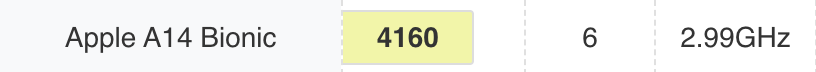
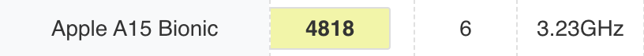
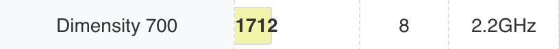

# [アマビエのアトリエ](https://twitter.com/search?q=%23%E3%82%A2%E3%83%9E%E3%83%93%E3%82%A8%E3%81%AE%E3%82%A2%E3%83%88%E3%83%AA%E3%82%A8&src=typed_query&f=live)

ここはお題に対して自分らしいアートとは何かを考えて Unity Editor 上で実現するための空間

# 動作確認で保証したもの

端末|プロセッサ|性能
---|---|---
iPhone 12|Apple A14 Bionic|
iPhone SE (3rd)|Apple A15 Bionic|
Android Libero 5G II|MediaTek Dimensity 700|

## reference

* [@lilxyzw](https://github.com/lilxyzw) さんの lilToon シェーダーをお借りしています ( [Booth - unitypackage 版](https://lilxyzw.booth.pm/items/3087170) )
  * エラーが出る場合、インストールを試みてください
* Picola inc. の [Pico ちゃん](https://assetstore.unity.com/packages/3d/characters/humanoids/picochan-220038) をお借りしています
  * エラーが出る場合、インストールを試みてください
